# 🎓 TaleemAI-Errata: Smart Education Reimagined

**TaleemAI-Errata** is Pakistan's first AI-powered education platform dedicated to transforming the National Curriculum into a world-class learning experience. By leveraging **Gemini's reasoning engine**, the platform identifies and audits errors in textbooks while providing a modernized, conceptual syllabus for students and teachers.

---

## 🚀 Core Modules

### 1. Refined Syllabus 📚
Experience a modernized approach to the **Single National Curriculum (SNC)** for Grades 6, 7, and 8.
- **Interactive Knowledge Graphs**: Visualize concepts and their interconnections.
- **Bilingual Support**: Full English and Urdu translations for inclusivity.
- **Conceptual Depth**: Content structured to move beyond rote learning toward deep understanding.

### 2. Errata Database 🔍
A transparent, real-time audit system for textbook quality improvement.
- **Factual Repairs**: Correcting scientific and historical inaccuracies.
- **Pedagogical Updates**: Improving how concepts are taught and explained.
- **Editorial Fixes**: Catching typos, grammatical errors, and formatting issues.
- **Page-Wise Search**: Precise navigation to specific textbook pages and their logged errors.

---

## � Tech Stack

- **Core**: [React 19](https://react.dev/) + [Vite](https://vitejs.dev/)
- **Styling**: [Tailwind CSS](https://tailwindcss.com/)
- **Icons**: [Lucide React](https://lucide.dev/)
- **Navigation**: [React Router 7](https://reactrouter.com/)
- **AI Engine**: Google Gemini (Content Refinement & Reasoning)
- **Data Layer**: Optimized JSON Graph Structures

---

## � Project Gallery

Discover the interface of **TaleemAI-Errata** through these screenshots.

<p align="center">
  
  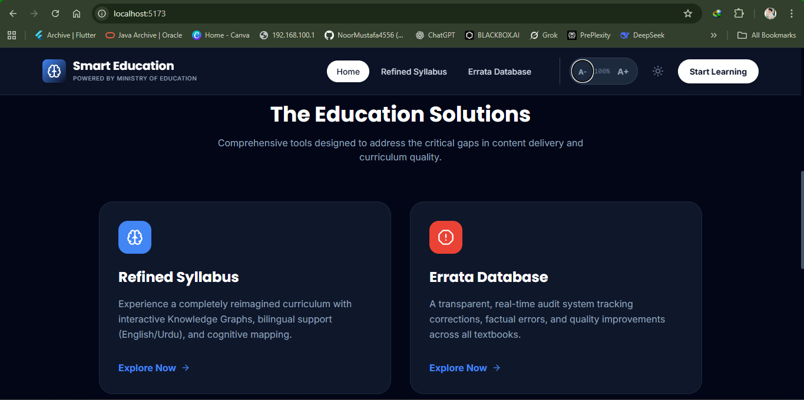
</p>
<p align="center">
  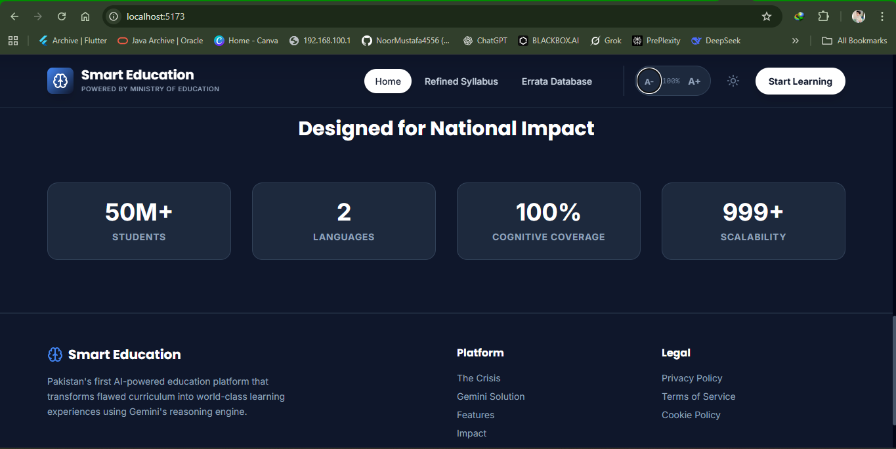
  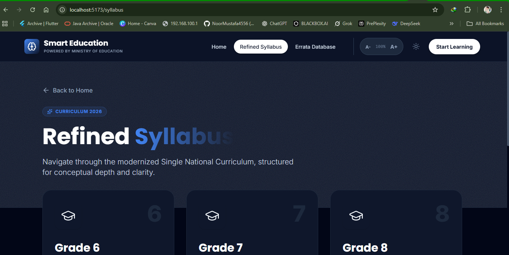
</p>
<p align="center">
  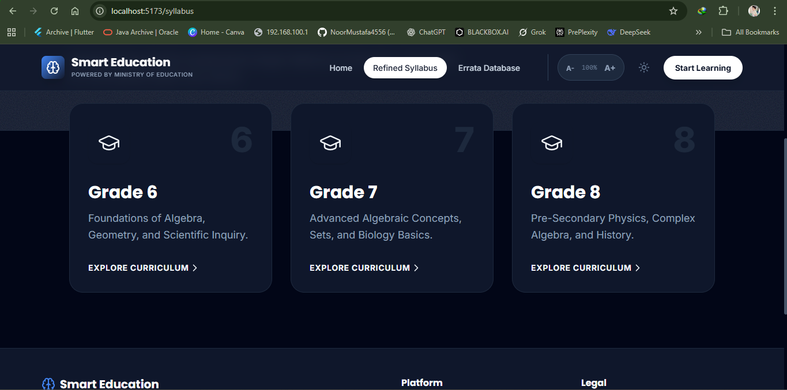
  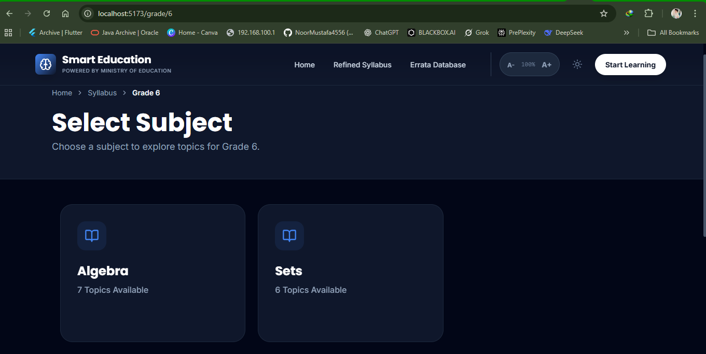
</p>
<p align="center">
  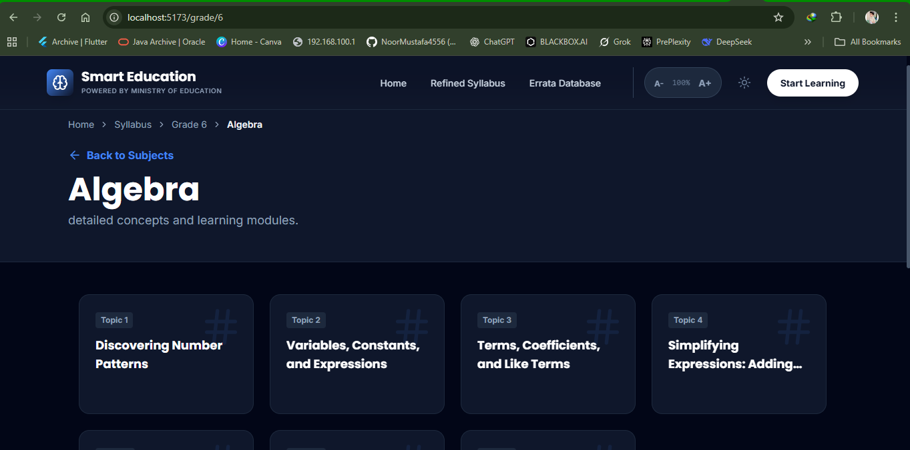
  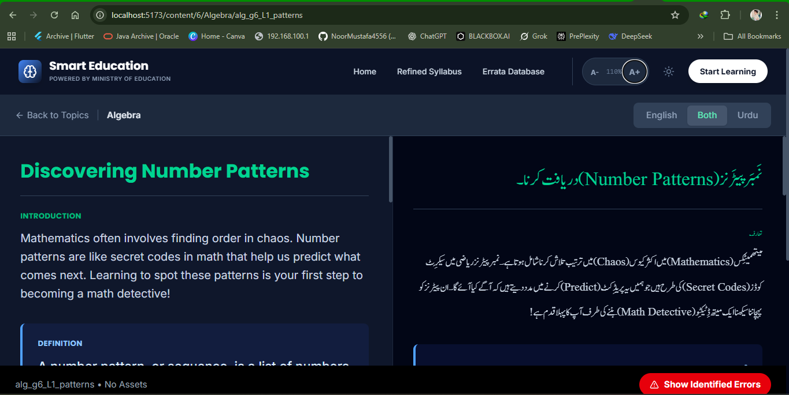
</p>
<p align="center">
  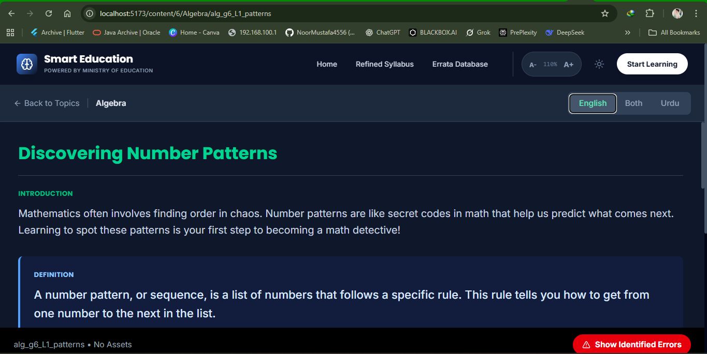
  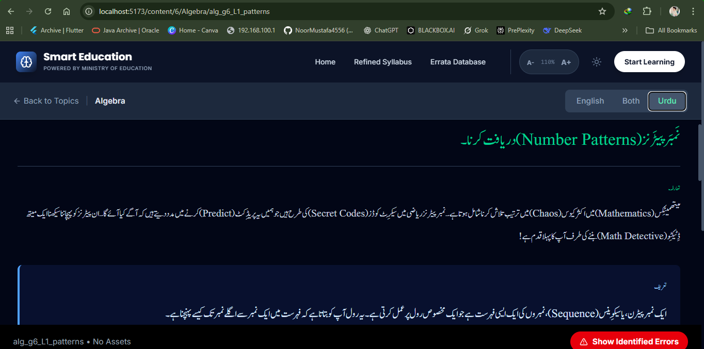
</p>
<p align="center">
  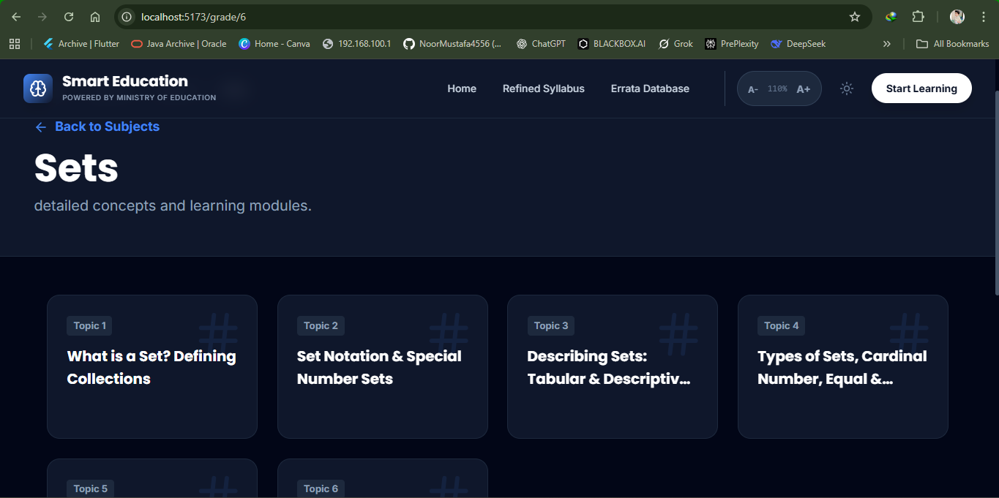
  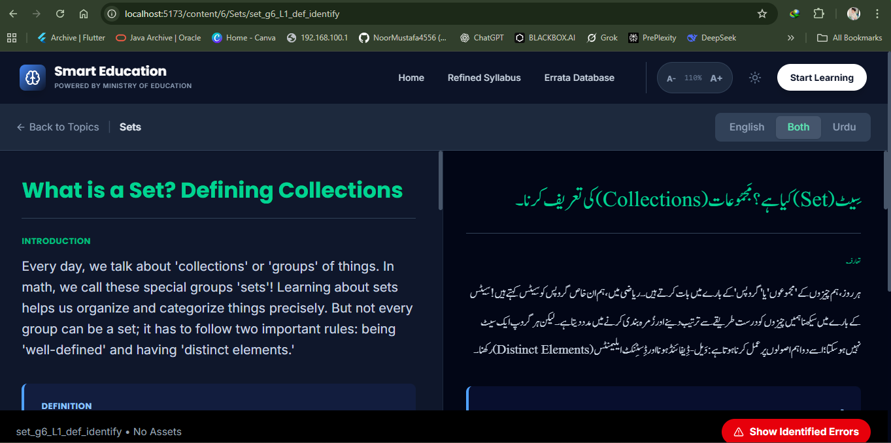
</p>
<p align="center">
  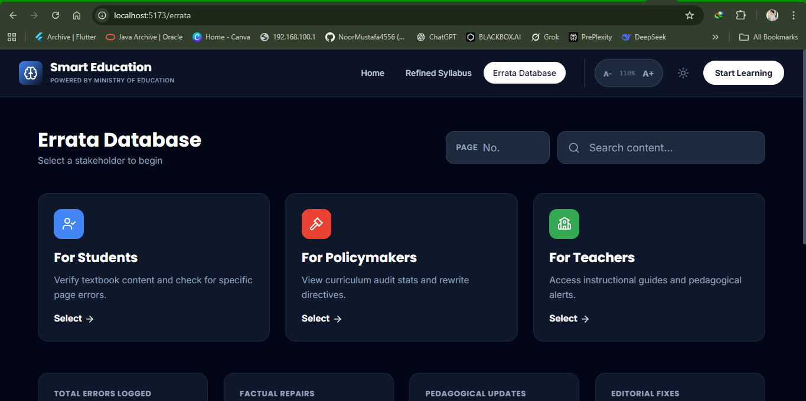
  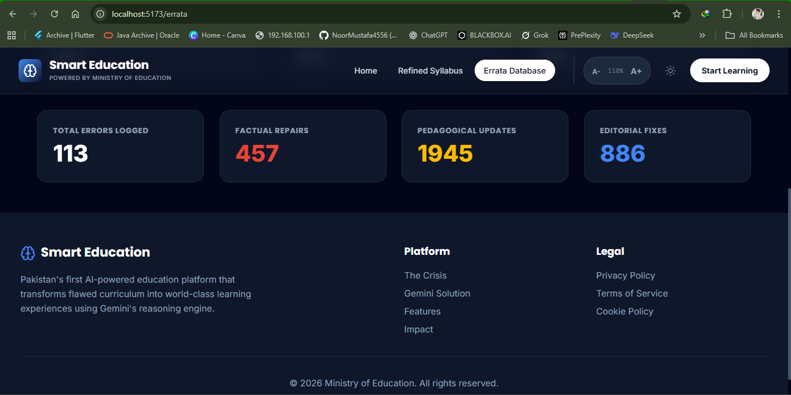
</p>
<p align="center">
  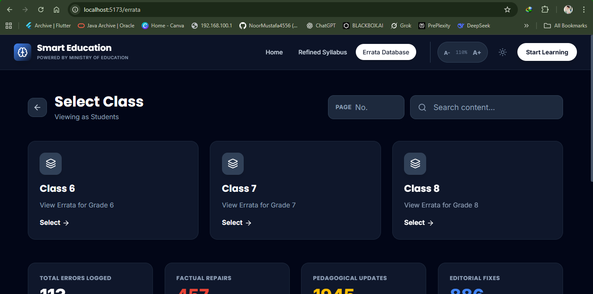
  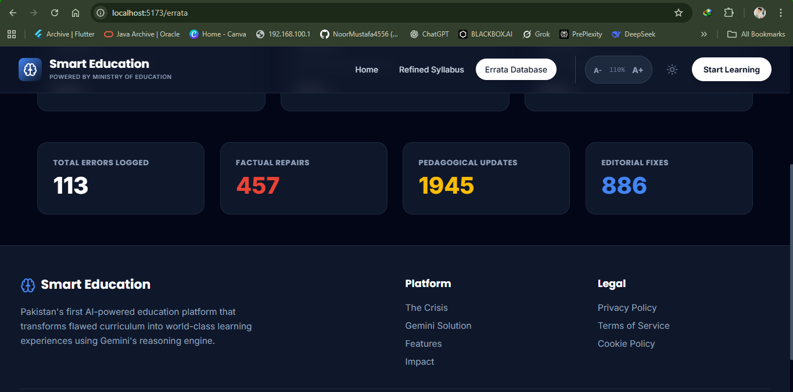
</p>
<p align="center">
  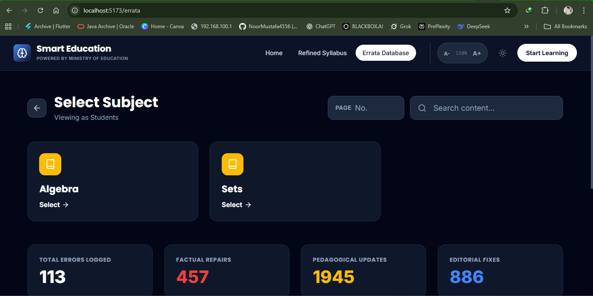
  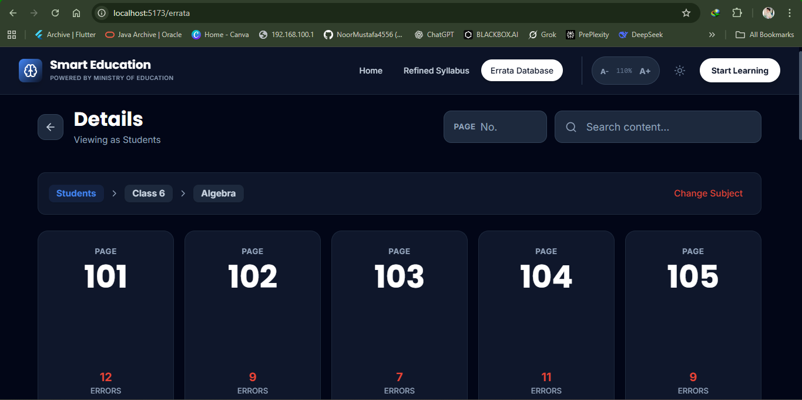
</p>

---

## � Getting Started

### 1. Clone & Install
```bash
git clone https://github.com/NoorMustafa4556/TaleemAI-Errata.git
cd TaleemAI-Errata
npm install
```

### 2. Run Development Server
```bash
npm run dev
```

---

## 👋 Connect with the Developer

**Noor Mustafa**  
*Software Developer | Bahawalpur, Pakistan*

<p align="left">
  <a href="https://github.com/NoorMustafa4556"></a>
  <a href="https://www.linkedin.com/in/noormustafa4556/"></a>
  <a href="https://wa.me/923087655076"></a>
</p>

---
> "Solving real-world education gaps, one line of code at a time."
